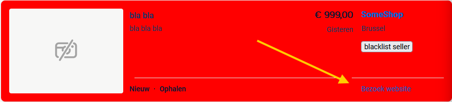
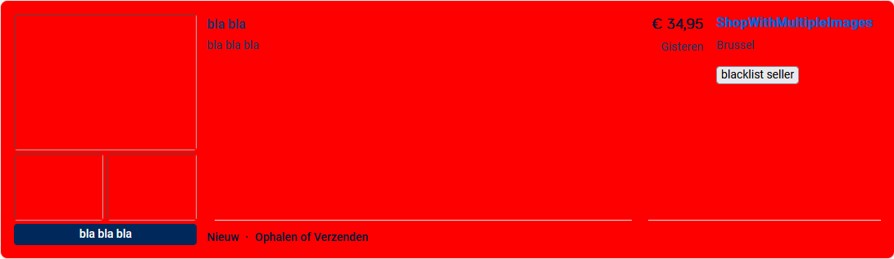

# 2dehands-extension
Extension for [2dehands](www.2dehands.be) which makes it easier to browse listings.  

- [x] toggle auto order by new-old
    > sometimes, when browsing multiple listings for a while, you have to reselect the "sort by" option to sort by "new-old".  
    > This toggle ensures that whenever you press Enter to query a listing, the sort option is applied.
- [x] actually sort listings
    > 2dehands tends to put ad/paid listings first. This toggle ensures that the actually latest listings get put first.
- [x] filters out [Ad listings](#Ad-listing) and [blacklisted sellers](#blacklist)
    > these are colored in either RED or PINK

## Installation
Download as zip.  
extract zip.  
go to `chrome://extensions/` and make sure developer mode is enabled.  
load extracted extension and select the folder.

## In Development
nothing

## Extra Info
### Ad Listing
Ad listings consist of:
> - "Topzoekertje" marking on bottom right (PINK)
>> annoying listings that get promoted to stay on top, which makes you miss out on good deals by "normal" sellers.
> - "Bezoek website" on the bottom right OR multiple images on the frontpage (RED)
>> webshops that are usually just promoting their "new" products

**promoted listing before extension**

**promoted listing after extension (PINK)**

**webshop listing after extension (RED)**

### blacklist
some sellers are just reposting and spamming the first pages of a query. Hence this blacklist feature.  

You can blacklist that seller with a "blacklist seller" button. Once clicked, all listings of this seller will be colored in RED.

you can whitelist them again by removing the seller in the All-in-One Menu.  

## FAQ for developers
**Why not manifest V3?**  
1. Manifest V2 is still supported
2. We would lose the "Auto Newest Filter" feature:  
In manifest V3, there's no way to append to an existing url fragment (in our case `sortBy:SORT_INDEX|sortOrder:DECREASING`).  
[Here]((https://developer.chrome.com/docs/extensions/develop/migrate/blocking-web-requests#redirect-multiple-urls))'s how an example how they migrate URL redirects.  
These rule files only allow you to **replace** the fragment, and not append a part to the existing fragment.  
So let's say you were browsing `https://www.2dehands.be/q/ps5/#Language:all-languages|distanceMeters:3000|postcode:1000`
In our manifest V2 implementation, we can append to the existing fragment: it would become `https://www.2dehands.be/q/ps5/#Language:all-languages|distanceMeters:3000|postcode:1000|sortBy:SORT_INDEX|sortOrder:DECREASING`
But if we used the rule file in manifest V3, that would be `https://www.2dehands.be/q/ps5/#sortBy:SORT_INDEX|sortOrder:DECREASING`.  
As you can see, we lose our `distanceMeters:3000|postcode:1000` fragment part.