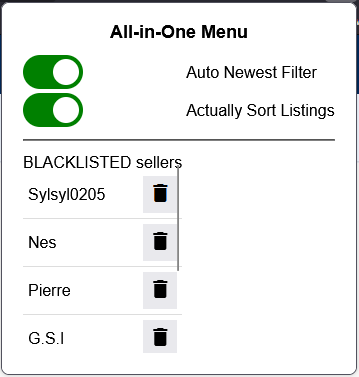
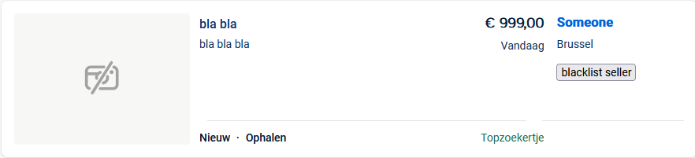
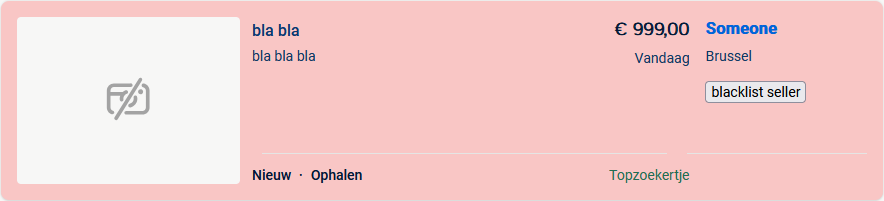
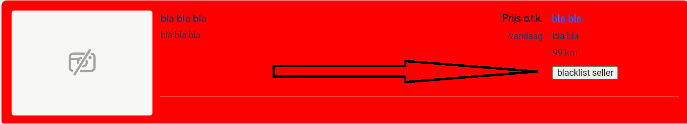
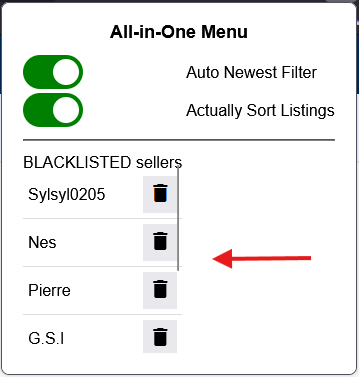

# 2dehands-extension
Extension for [2dehands](www.2dehands.be) which makes it easier to browse listings.  

- [x] toggle auto order by new-old
    > sometimes, when browsing multiple listings for a while, you have to reselect the "sort by" option to sort by "new-old".  
    > This toggle ensures that whenever you press Enter to query a listing, the sort option is applied.
- [x] actually sort listings
    > 2dehands tends to put ad/paid listings first. This toggle ensures that the actually latest listings get put first.
- [x] filters out [Ad listings](#Ad-listing) and [blacklisted sellers](#blacklist)
    > these are colored in red

## Installation
Download as zip.  
extract zip.  
go to `chrome://extensions/` and make sure developer mode is enabled.  
load extracted extension and select the folder.

## In Development
nothing

## Extra Info
### Ad Listing
these are annoying listings that get promoted to stay on top, which makes you miss out on good deals by "normal" sellers.

Ad listings may consists of:
- "Topzoekertje" marking on bottom right

**before**

**after**

### blacklist
some sellers are just reposting and spamming the first pages of a query. Hence this blacklist feature.

now you can blacklist them via a button next under their name next to a listing.  

you whitelist them again the blacklisted seller in the All-in-One Menu.  

